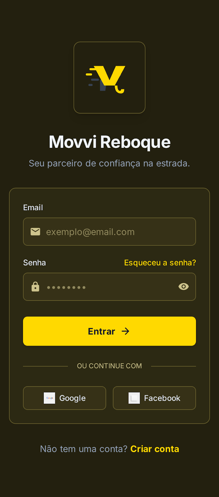
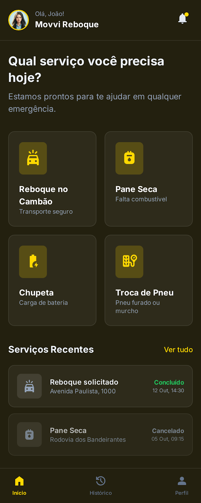
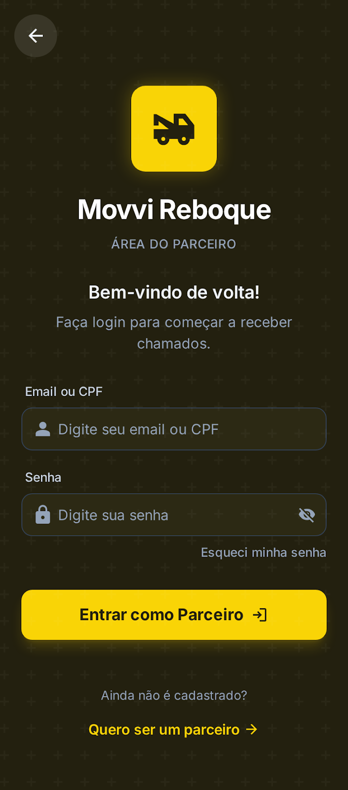
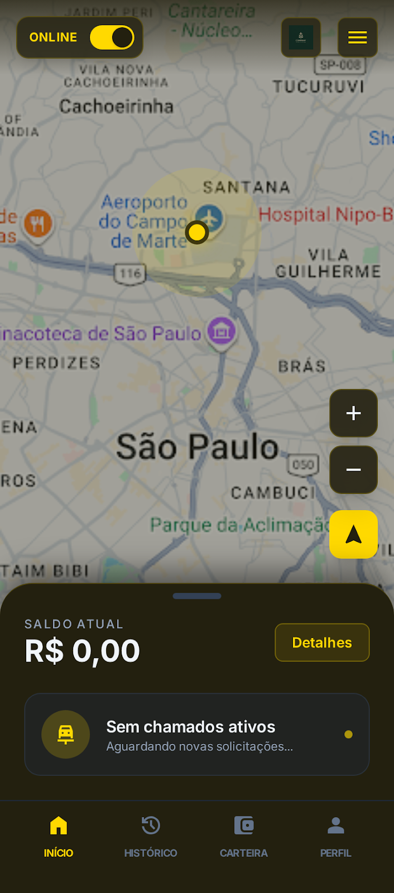
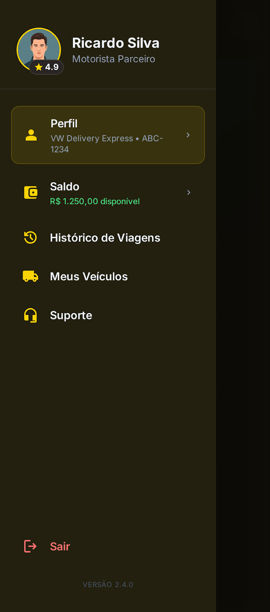

# Movvi Resgate - Gestão e Logística de Assistência Rodoviária

O **Movvi Resgate** é uma plataforma de alta performance desenvolvida para centralizar e otimizar o fluxo de atendimento de reboques e assistência técnica. O ecossistema é composto por quatro pilares fundamentais, todos integrados em tempo real via WebSockets para garantir precisão e agilidade operacional.

---

## 🛰️ Painel Administrativo (Central de Controle)

O cérebro da operação. Permite a gestão completa da frota, auditoria financeira e monitoramento geográfico em tempo real.

- **Dashboard Financeiro (RRL):** Visualização imediata de Volume Operacional Bruto (GMV), Repasses à Frota (85%) e Comissões da Plataforma (15%).
- **Gestão de Frota e Liberações:** Controle rigoroso de cadastro de motoristas, aprovação de documentos (CNH/CRLV) e quitação de débitos.
- **Configuração Financeira Dinâmica:** Ajuste instantâneo de taxas base e valor por quilômetro sem necessidade de novas implementações.

<div align="center">
  
</div>

---

## 📡 Website Institucional

Portal de entrada para clientes e captação de novos parceiros guincheiros.

- **Página Principal:** Focada na conversão imediata de clientes em situação de emergência.
- **Onboarding de Parceiros:** Seção dedicada a atrair motoristas, detalhando os benefícios de ganhos extras com o "Kit Resgate".

<div align="center">
  
</div>

---

## 📱 Aplicativo do Cliente

Interface simplificada para o usuário final, priorizando a velocidade de solicitação em momentos de estresse.

- **Acesso Rápido:** Login intuitivo para clientes cadastrados.
- **Painel de Serviços:** Seleção direta entre Reboque, Pane Seca, Carga de Bateria ou Troca de Pneu.
- **Acompanhamento ao Vivo:** Rastreamento do motorista parceiro no mapa com estimativa de chegada e visualização de rota.

<div align="center">
  <table>
    <tr>
      <td align="center"><b>Login do Cliente</b></td>
      <td align="center"><b>Dashboard de Serviços</b></td>
      <td align="center"><b>Menu Lateral</b></td>
    </tr>
    <tr>
      <td></td>
      <td></td>
      <td></td>
    </tr>
  </table>
</div>

---

## 🚚 Aplicativo do Motorista Parceiro

Ferramenta de trabalho do profissional, focada na navegação e gerenciamento de chamados.

- **Controle de Disponibilidade:** Botão "Online/Offline" para gestão de jornada.
- **Monitoramento de Ganhos:** Extrato detalhado de serviços realizados e saldo disponível na carteira virtual.
- **Radar de Pedidos:** Tela de espera dinâmica que notifica novos serviços na região próxima.

<div align="center">
  <table>
    <tr>
      <td align="center"><b>Login do Motorista</b></td>
      <td align="center"><b>Status Online e Mapa</b></td>
      <td align="center"><b>Menu do Motorista</b></td>
    </tr>
    <tr>
      <td></td>
      <td></td>
      <td></td>
    </tr>
  </table>
</div>

---

## 🛠 Stack Tecnológica

O projeto utiliza tecnologias de ponta para garantir baixa latência e escalabilidade:

- **Frontend:** HTML5 Semântico, Tailwind CSS, JavaScript Vanilla (ES6+).
- **Backend:** Node.js com Framework Express.
- **Real-Time:** Socket.IO para sincronização instantânea de dados.
- **Mapas:** Leaflet.js para renderização de geolocalização e rotas.
- **Banco de Dados:** NeDB para persistência de dados local em formato JSON.

---

## 🚀 Guia de Instalação Local

1. **Clonagem do Repositório:**
   ```bash
   git clone https://github.com/leandropalmeiradesouza81-hub/Movvi-Resgate.git
   cd Movvi-Resgate
   ```

2. **Instalação de Dependências:**
   ```bash
   npm install
   ```

3. **Execução do Ambiente de Desenvolvimento:**
   ```bash
   npm run dev
   ```

4. **Acesso aos Módulos:**
   - **Cliente:** `http://localhost:5173/`
   - **Administrativo:** `http://localhost:5173/admin.html`
   - **Motorista:** `http://localhost:5173/driver/`
